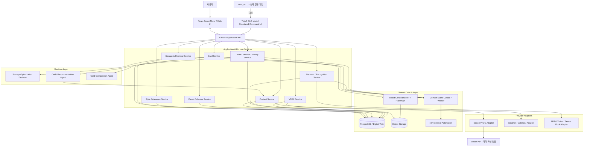
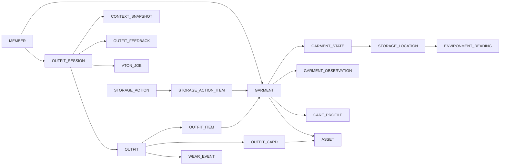
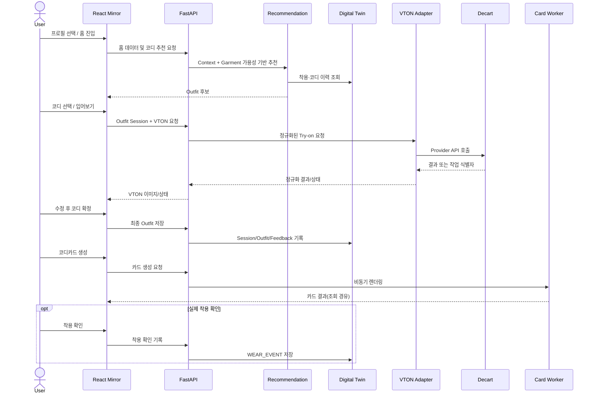

# Smart Wardrobe — 통합 프로토타입 HLD v1.1

> 문서 유형: High-Level Design (논리 아키텍처)  
> 작성일: 2026-10-08  
> 기준: 기존 `smart_wardrobe_architecture_v1.md` + Smart Wardrobe IA 초안 + 프로토타입 VTON 대체 전략  
> 상태: 구현 기준 **설계 초안**. 외부 API 규격·실제 하드웨어 능력은 미검증.  
> 후속 문서: FSD → Backend LLD → OpenAPI → PostgreSQL DDL → Codex 구현 명세

## 1. 목적과 범위

### 1.1 목표

Smart Wardrobe의 세 가지 Agent(보관·찾기, 코디 추천, 코디카드)와 공통 Wardrobe Digital Twin을 기반으로, 스마트미러의 사용자 경험 전체를 **React 웹 프로토타입**에서 시연한다. 실제 LG 스마트미러·ThinQ CLO의 내부 구현을 재현하지 않으며, 필요한 외부 기능은 명시적인 Adapter/Mock으로 대체한다.

### 1.2 설계 계층

| 계층 | 책임 | 프로토타입 구현 |
|---|---|---|
| Product / Experience | 홈·옷장·코디·캘린더·케어·마이, 공통 입어보기·코디카드 | React UI |
| Application | 인증/프로필, API, 세션, 도메인 서비스, 작업 상태 | FastAPI + Pydantic + SQLAlchemy |
| Decision / Agent | 보관 최적화, 개인화 코디 추천, 코디카드 구성 판단 | Python Rule/Scoring; 필요 시 LLM/LangGraph |
| Integration | Decart VTON, ThinQ CLO 대체, 날씨·일정, 의류 인식 | Provider Adapter + Mock |
| Data / Events | Digital Twin, Outfit History, Context, Feedback, 비동기 작업 | PostgreSQL + Object Storage + Worker |
| Automation | 정기 동기화, 알림, 외부 워크플로 | n8n (선택적) |

### 1.3 설계 원칙

1. **Single Source of Truth:** 의류와 현재 상태는 공통 Digital Twin을 기준으로 한다.
2. **Agent ≠ 모든 기능:** 단순 검색·CRUD·관리 가이드·렌더링은 일반 서비스로 구현한다.
3. **Outfit 중심 개인화:** `Context → Outfit Recommendation → Session/Feedback → Wear History`를 유지한다.
4. **가상 착용 ≠ 실제 착용:** VTON 완료, 코디 확정, 미러 종료, 실제 착용 확인은 서로 다른 상태다.
5. **외부 엔진 교체 가능성:** VTON과 ThinQ CLO 연동은 내부 인터페이스 뒤에 숨긴다.
6. **Backend-first:** 프론트 화면 구조는 IA에 따르되, API 계약과 도메인 상태를 백엔드가 소유한다.
7. **Prototype fidelity:** 실연동·Mock·시연용 Seed 데이터를 구분하고, 미구현 기능을 실제 동작처럼 오인시키지 않는다.

## 2. 통합 논리 아키텍처



**경계:** 다이어그램은 논리적 의존성을 표현한다. Agent가 DB에 직접 무제한 접근하는 구조가 아니라 각 도메인 서비스의 권한·검증을 거쳐 조회/변경한다. n8n은 핵심 세션·DB 트랜잭션의 실행 엔진이 아니다.

## 3. IA — 화면 및 공통 흐름

원본 IA의 계층 구조와 점선/파란색 연결 의미를 보존한다.

```text
잠금화면 → 홈 (오늘의 코디 · 케어 알림)
             ├─ 옷장
             │   ├─ 내 옷 보기
             │   ├─ 옷 상세 ───────────────┐
             │   └─ 옷 등록               │
             ├─ 코디                      │
             │   ├─ 내 코디               │
             │   ├─ 스타일 보관함          │
             │   │   ├─ 전체              │
             │   │   ├─ 인스타            │
             │   │   └─ 쇼핑몰            │
             │   └─ 코디 만들기 ──────────┤
             ├─ 캘린더                    │
             │   └─ 착용 · 케어 기록 ──────┤
             ├─ 케어                      │
             │   ├─ 관리 일정             │
             │   └─ 관리 가이드           │
             └─ 마이                      │
                 └─ 설정                  │
                                         ▼
                          [공통 입어보기 / VTON]
                                         │ 코디 확정
                                         ▼
                          [코디카드: 저장·공유·재사용]
                                         │ 저장/불러오기
                                         ▼
                                     [내 코디]
```

> IA에서 공통 입어보기로의 진입은 옷 상세, 코디 만들기, 착용·케어 기록 및 홈 알림과 연결된다. 기타 화면의 진입은 FSD에서 추가 가능하되 원본 IA의 확정 경로로 간주하지 않는다.

### 3.1 화면-서비스 매핑

| 화면/기능 | 주요 서비스 | 주요 데이터 | 비고 |
|---|---|---|---|
| 잠금화면·홈 | Profile, Dashboard, Context, Recommendation, Care | Member, Context, Recommendation, Care | 프로필 선택 기반 Mock 인증 가능 |
| 내 옷 보기·옷 상세 | Garment, Storage, Care | Garment, State, Location, CareProfile | 의류 검색·상세·위치 |
| 옷 등록 | Garment, Recognition | Garment, Image, Observation | 이미지 등록 필수, 센서 인식 Mock 가능 |
| 내 코디 | Outfit, Card | Outfit, OutfitCard | 저장/불러오기 |
| 스타일 보관함 | Style Reference | StyleReference, Source | 전체·인스타·쇼핑몰은 출처 분류 |
| 코디 만들기 | Outfit, Recommendation | Outfit, Context, Garment | 수동 구성과 추천 후보 모두 지원 |
| 착용·케어 기록 | History, Care | WearEvent, CareEvent | 캘린더 집계 |
| 관리 일정·가이드 | Care | CareSchedule, CareProfile | 일정과 실제 수행 구분 |
| 마이·설정 | Profile, Integration Settings | Member, Settings | 데모용 프로필 설정 |
| 공통 입어보기 | VTON, Outfit Session | Session, Outfit, VTON Job | Decart Adapter |
| 코디카드 | Card, Renderer | Outfit, Context, CardAsset | PNG/WebP 생성 |

### 3.2 공통 입어보기 화면 계약(논리)

- 입력: `entry_point`, `member_id`, `outfit_id?`, `garment_ids?`, `context_snapshot_id?`.
- 동작: 세션 생성 → 의류 조합 편집 → VTON 요청 → 작업 상태/결과 표시 → 선택·수정 → 최종 코디 확정.
- 출력: `outfit_session_id`, `selected_outfit_id`, `vton_result_asset_id?`.
- **중요:** VTON 이미지는 시각화 산출물이다. 코디 구성의 정본은 `OUTFIT_ITEM`이며 VTON 이미지에서 역추론하지 않는다.

## 4. Agent 및 일반 서비스 책임

### 4.1 보관·찾기 (Storage & Retrieval)

| 기능 | 분류 | 핵심 흐름 |
|---|---|---|
| A. 의류 찾기 | 일반 서비스 | Structured Query → Garment Locator → 의류·위치·신뢰도 반환 |
| B. 옷장 구성 최적화 | 의사결정 | 착용 이력·계절·상태 → Scoring/Rules → 보관·회수 제안 |
| C. 특별 관리 의류 | 일반 서비스 | CareProfile/케어라벨 → Rule Engine → 관리 가이드 |
| D. 보관 공간 최적화 | 의사결정 | 용량·온습도·소재 제약 → Constraint Solver → 배치 제안 |

```text
자연어 입력 → ThinQ CLO (실제 인터페이스 미확인)
                     또는 Mock Structured Command
→ {owner_id, category, color, ...}
→ FastAPI Garment Locator → PostgreSQL
→ {garment_id, location_id, location_confidence, last_seen_at}
→ UI / ThinQ CLO 응답
```

검색 자체에 별도 LLM/LangGraph를 요구하지 않는다. 보관 제안은 사용자 승인 후 실제 이동이 확인되어야 상태에 반영된다.

### 4.2 사용자 옷 추천 (Outfit Recommendation)

```text
날씨·기온·습도·강수·위치 + 일정·만남 대상 + 날짜·요일·휴일
→ Context Snapshot
→ Garment 상태/가용성 Filtering
→ Outfit 후보 조합
→ 사용자 선호·Outfit History 기반 Scoring
→ Top-K 추천 / 근거
→ 공통 입어보기 (Decart VTON)
→ 변경 이력·최종 선택 저장
→ 실제 착용 확인 시 WearEvent 생성
→ Feedback / History 집계 → 다음 추천 반영
```

- 개인화 학습 단위: `Outfit + Context + Feedback`.
- 초기 데이터 부족 시 룰·스타일 조건 기반 추천을 제공한다.
- 추천·VTON 사용·최종 선택·실제 착용은 별개의 관측 이벤트로 기록한다.
- 추천에 사용되는 일정·위치·만남 대상은 최소 수집하고 접근 제어한다.

### 4.3 코디카드 (Outfit Card)

```text
Figma 디자인 시안 (개발 단계)
→ React/CSS CardTemplate 구현
→ Agent/Rule: template_id, outfit_id, asset refs, metadata 구성
→ Background Render Job
→ React Card Renderer + Playwright Screenshot
→ 1080×1350 PNG/WebP
→ Object Storage + OutfitCard 레코드
→ 코디카드 화면: 저장·공유·재사용
```

예시 논리 입력:

```json
{
  "template_id": "look-editorial-01",
  "outfit_id": "outfit-1024",
  "title": "TODAY'S LOOK",
  "items": {
    "top": "shirt_023",
    "bottom": "pants_041",
    "shoes": "shoes_012"
  },
  "style_tag": "Minimal Casual",
  "weather_label": "18°C",
  "date": "2026-10-08"
}
```

`items` 값은 실제 구현 시 이미지 파일명이 아니라 의류/에셋 식별자로 해석한다. 렌더링은 Agent의 추론 과정이 아닌 결정론적 백엔드 작업이다.

## 5. Decart VTON 통합 설계

### 5.1 제품 기능과 프로토타입 대체 범위

| 기능 | 실제 제품 가정 | 프로토타입 |
|---|---|---|
| 전신 스마트미러 UI | LG 스마트미러 환경 | React 웹 화면 |
| 가상 피팅 | 제품 내/연계 VTON | Decart API를 통한 VTON Adapter |
| 자연어 의도 해석 | ThinQ CLO | Structured Command Mock |
| 의류 인식/위치 | RFID·Vision·IoT | 이미지 등록 + Seed Observation / Mock Sensor |
| 날씨·일정 | 외부/연계 데이터 | Adapter (실연동 또는 Mock) |
| 의류 관리·추천·카드 | 자체 Agent/서비스 | FastAPI + Python + Renderer |

**주의:** Decart가 특정 다중 의류 조합, 실시간 영상, 입력 이미지 규격, 비동기 콜백을 지원하는지는 아직 검증되지 않았다. 지원하지 않는 동작을 지원한다고 가정하지 않는다.

### 5.2 Provider-neutral VTON 계약

```text
React UI
  → VTON Service (인증·권한·세션 검증)
  → VTON Provider Interface
  → Decart Adapter
  → Decart API
  → Provider 결과/오류 정규화
  → Asset 저장 및 VTON Job 상태 갱신
  → UI 상태 조회/결과 표시
```

Provider 인터페이스의 논리 작업:

- `create_try_on(person_asset, garment_assets, options) -> job_id | result`
- `get_try_on_status(job_id) -> pending | running | succeeded | failed`
- `get_try_on_result(job_id) -> result_asset_id | error`

이는 **내부 추상 계약**이며 Decart의 실제 엔드포인트·필드명·과금/제한을 의미하지 않는다. 실제 지원 방식에 맞춰 Adapter가 동기/비동기를 흡수한다. 복수 의류 합성 미지원 시 순차 호출 또는 데모용 대체 흐름을 별도 결정한다.

### 5.3 실패 및 보안 경계

- 외부 호출 실패·타임아웃·할당량 초과: Job 실패 상태와 재시도 가능 여부를 표시한다.
- 사용자 이미지/신체 사진: 서버에서 비밀키를 보관하고, 업로드 동의·보존 정책·접근 통제를 적용한다.
- Provider 응답 URL은 장기 영속 URL이라고 가정하지 않고 필요한 경우 적법한 범위에서 저장소에 복사한다.
- API 키는 브라우저에 노출하지 않는다.

## 6. 공통 Digital Twin — 논리 데이터 모델

### 6.1 기존 11개 보관 도메인 테이블

`HOUSEHOLD`, `MEMBER`, `STORAGE_LOCATION`, `GARMENT`, `GARMENT_STATE`, `GARMENT_OBSERVATION`, `WEAR_EVENT`, `CARE_PROFILE`, `ENVIRONMENT_READING`, `STORAGE_ACTION`, `STORAGE_ACTION_ITEM`.

### 6.2 통합 확장 엔티티

| 엔티티 | 역할 |
|---|---|
| `OUTFIT` | 코디 조합의 식별자 |
| `OUTFIT_ITEM` | Outfit–Garment 다대다 연결, 착장 슬롯 |
| `OUTFIT_SESSION` | 추천·수정·VTON·확정의 사용자 세션 |
| `OUTFIT_SESSION_EVENT` | 코디 변경·시도·선택 등 세션 이력 |
| `CONTEXT_SNAPSHOT` | 특정 시점의 날씨·일정·시간·위치 맥락 |
| `OUTFIT_FEEDBACK` | 추천 채택/수정/거절 및 명시적 평가 |
| `OUTFIT_CARD` | 카드 템플릿·이미지·렌더 상태 |
| `STYLE_REFERENCE` | 외부 스타일 참고자료와 출처 |
| `CARE_SCHEDULE` / `CARE_EVENT` | 케어 계획과 수행 이력 |
| `VTON_JOB` | 외부 생성 작업 상태·입출력 자산 |
| `ASSET` | 의류 이미지·인물 이미지·VTON·카드 파일 메타데이터 |
| `GARMENT_TAG` | RFID 교체·복수 태그 확장 |
| `DOMAIN_EVENT_OUTBOX` | 트랜잭션 연동 이벤트 전달 |

이는 논리 엔티티 목록이며 최종 테이블 개수와 컬럼은 DB 물리설계에서 확정한다.



**데이터 규칙:** `GARMENT_STATE`는 최신 추정 상태, `GARMENT_OBSERVATION`은 원시 관측 이력이다. 위치 미확인 시 `location_id = NULL`을 허용하고 신뢰도/관측 시각을 보존한다. `WEAR_EVENT`는 실제 착용이 확인된 경우에만 생성한다. Outfit–WearEvent의 실제 FK 및 복수 착용 처리 방식은 LLD/DDL에서 확정한다.

## 7. 주요 End-to-End 시퀀스

### S1. 홈 추천 → VTON → 카드 → 착용 이력



### S2. 의류 위치 검색

```text
사용자 요청 → ThinQ CLO Mock/Structured UI
→ 조건 파싱 완료 요청 → Garment Locator
→ 사용자/가구 접근 권한 검사 → Garment + State + Location 조회
→ 위치·인식 신뢰도·마지막 관측 시각 반환
```

### S3. 보관 최적화 → 승인 → 상태 갱신

```text
정기 실행/사용자 요청 → 착용·계절·공간·환경 데이터 집계
→ Storage Decision (Scoring / Constraint Solver)
→ StorageAction 제안 저장 → 사용자 승인
→ 실제 이동 수행/확인 → GarmentObservation 또는 이동 확인 이벤트
→ GarmentState 갱신 → 다음 조회/추천에 반영
```

### S4. 코디카드 생성

```text
Outfit 확정 또는 저장된 Outfit 선택
→ CardGenerationRequested
→ 템플릿/이미지/메타데이터 해석
→ React Card Renderer → Playwright 캡처
→ Object Storage 업로드 → OutfitCard 갱신
→ UI에 저장/공유/재사용 제공
```

## 8. 이벤트와 상태 경계

| 이벤트 | 트리거 | 후속 영향 |
|---|---|---|
| `GarmentObserved` | 센서/Mock 관측 | 상태 추정 및 갱신 |
| `GarmentStateChanged` | 의류 상태 확정 갱신 | 가용성·위치 조회 반영 |
| `OutfitRecommended` | 추천 결과 생성 | 추천 세션 기록 |
| `OutfitModified` | 사용자 코디 수정 | 세션 변경 이력 |
| `OutfitSessionEnded` | 입어보기 세션 종료 | 최종 선택 상태 저장, 착용 확정 아님 |
| `OutfitWearConfirmed` | 실제 착용 확인 | WearEvent 및 패턴 집계 |
| `CardGenerationRequested` | 카드 생성 요청 | 비동기 렌더링 |
| `CardGenerated` / `CardGenerationFailed` | 렌더 완료/실패 | 카드 상태 갱신 |
| `StorageActionApproved` | 보관 제안 승인 | 실행 대기 |
| `StorageActionCompleted` | 이동 확인 | 상태 갱신 |

모든 이벤트는 논리적으로 `event_id`, `event_type`, `aggregate_id`, `occurred_at`, `schema_version`, `payload`를 포함한다. 이벤트 발행과 DB 변경의 정합성은 Outbox + 멱등 처리로 설계한다.

## 9. 기술 구성 및 배포 경계

| 컴포넌트 | 기술 후보 | 배포/운영 주의 |
|---|---|---|
| Mirror/Web UI | React + TypeScript | VTON API 키 보관 금지 |
| API / Domain Services | FastAPI, Pydantic, SQLAlchemy | 접근 권한 및 트랜잭션 소유 |
| Decision Engine | Python Rules, Scoring, Solver | Agent 오케스트레이션은 필요할 때만 |
| Persistence | PostgreSQL | Household/Member 접근 제어 |
| Image Storage | S3 호환 Object Storage | 임시 이미지 보존 정책 |
| VTON | Decart Adapter | 실제 계약·지원 기능 확인 전 |
| Card Renderer | React/CSS + Playwright | 백그라운드 작업자에서 실행 |
| Async | Worker + Job/Outbox | VTON·카드 생성 상태 추적 |
| External Automation | n8n | 외부 동기화/알림에 한정 |
| Mock | ThinQ CLO, Recognition, Weather/Calendar | 실연동과 구분되는 설정 |

### 9.1 프로토타입 모드

- `mock`: 외부 의존성을 전부 대체하고 Seed 데이터로 E2E 시연.
- `hybrid`: Decart 실연동, 나머지 인식/CLO/일정은 Mock.
- `integrated`: 지원되는 외부 API만 실제 Adapter로 연결.

세 모드는 동일한 내부 서비스 계약을 사용한다. 모드 전환 시 데이터가 뒤섞이지 않도록 시연 데이터와 실제 데이터를 구분한다.

## 10. 프로토타입 구현 범위 및 제외 범위

### 구현 목표

1. IA 전체 메뉴를 탐색할 수 있는 React Smart Mirror/Web 화면.
2. 의류 등록·조회·위치·상태 및 공통 Digital Twin 조회.
3. Context 기반 코디 추천과 수정/확정/세션 이력.
4. Decart Adapter를 통한 VTON 요청 및 결과 표시(실제 제공 기능 범위 내).
5. 코디카드 PNG/WebP 생성, 저장·공유·재사용.
6. 캘린더 착용·케어 기록, 관리 가이드·일정.
7. 보관·찾기 조회 및 최적화 제안/승인 데모.
8. 외부 연동 실패를 포함한 API 상태 처리와 Seed 데이터.

### 범위 밖 또는 Mock

- 실제 LG 스마트미러 하드웨어 펌웨어·ThinQ CLO 비공개 내부 API 개발.
- RFID/카메라/센서의 실물 하드웨어 제어 및 현장 정확도 보장.
- VTON의 실시간 영상, 복수 의류 동시 착용, 소재·핏 정확도에 대한 검증되지 않은 보장.
- 미러 종료만으로 실제 착용을 자동 확정하는 기능.
- Instagram/쇼핑몰의 비공식 크롤링·무단 이미지 수집. 초기에는 사용자가 등록한 참고자료 또는 허용된 소스 사용.

## 11. HLD → FSD 인계 사항

FSD에서 각 기능을 `COM`, `GAR`, `REC`, `OUTFIT`, `STYLE`, `VTON`, `CARD`, `HIST`, `CARE`, `STO`, `SET` ID로 관리한다. 현재 기능 인벤토리 초안은 28개이며 최종 세분화는 FSD에서 결정한다.

특히 다음을 기능 단위로 명세한다.

- 화면 진입점별 입어보기 초기 데이터 및 세션 종료/복원.
- Decart Provider가 지원하지 않는 기능에 대한 폴백 UI/Mock.
- VTON·카드 생성의 비동기 상태, 재시도, 오류 안내.
- 추천·최종 선택·실제 착용을 구분하는 저장 규칙.
- 가구원별 의류 열람 권한 및 가족 간 의류 공유.
- 보관 위치 신뢰도/미확인 상태와 이동 승인·완료 분리.
- 스타일 보관함의 출처 구분과 코디 재사용 흐름.
- 홈·캘린더·케어의 집계 기준과 알림 조건.

## 12. 확정 사항과 미확정 사항

| 구분 | 항목 | 상태 |
|---|---|---|
| 확정 | 3개 Agent + 공유 Digital Twin | 설계 기준 |
| 확정 | 제공된 IA의 5개 메인 메뉴 + 공통 입어보기·코디카드 | 설계 기준 |
| 확정 | 프로토타입 VTON은 Decart Adapter로 대체 | 설계 방향 |
| 확정 | 미러 종료 ≠ 실제 착용 확정 | 데이터 규칙 |
| 확정 | Backend-first, FSD → Backend LLD → API/DB | 개발 프로세스 |
| 미확정 | Decart API 모델·인증·입출력·지연·다중 의류 지원 | 외부 계약 확인 필요 |
| 미확정 | ThinQ CLO 실제 호출/응답 인터페이스 | Mock으로 대체 |
| 미확정 | 실물 RFID/Vision/IoT 인식 방식 | Mock 우선 |
| 미확정 | 배포 인프라·Object Storage 공급자·Worker 구현체 | LLD에서 선택 |
| 미확정 | 실제 착용 자동 판정 방식 | 명시적 확인 우선 |

---

**다음 단계:** `04_FSD.md`에서 IA 기반 기능별 Trigger, Input, Preconditions, Processing, Output, Exception, State Change, Acceptance Criteria를 정의한다. 이 문서는 API 엔드포인트나 물리 DDL을 미리 확정하지 않는다.

## Sprint 1 계약 개정 (2026-10-08)

사용자 승인에 따라 네 충돌의 정책을 확정했다. [결정 계약](SPRINT_1_CONTRACT_DECISIONS.md)이 Sprint 1의 역할·상태·공유·동의·보관·관측·삭제 정책의 기준이며, 개정 OpenAPI 1.1.0 및 DDL과 함께 적용한다. DEMO는 역할이 아닌 인증 모드다. 0001 SQL은 동결하고 0002 전진 migration으로 현재 32개 테이블을 구성한다. 케어 가이드 본문과 실제 센서 ingress는 기존 후속 Sprint/Mock 경계를 유지한다. 의류 이미지만 30일 보관하고 PERSON/VTON 자산 정책은 해당 Sprint에서 별도 확정한다.
