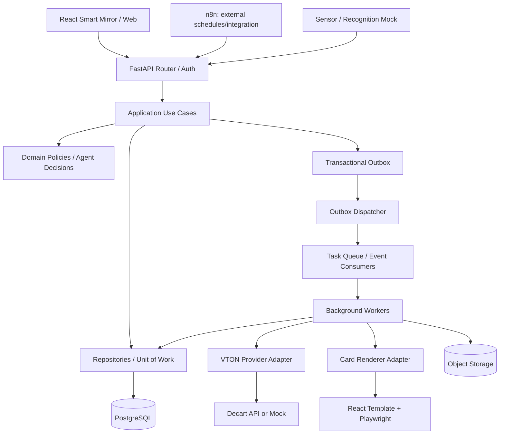
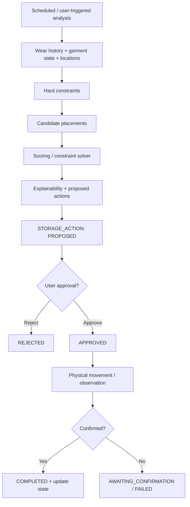
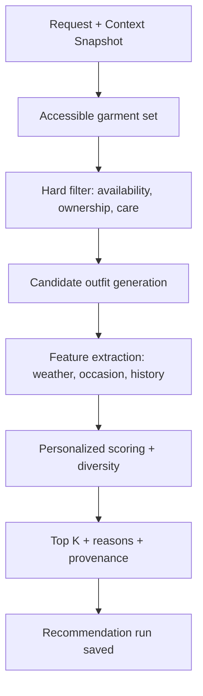
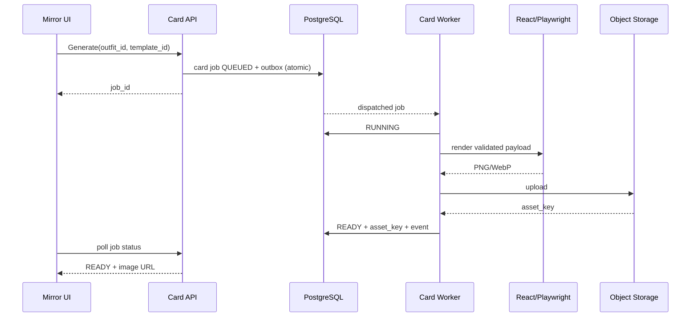
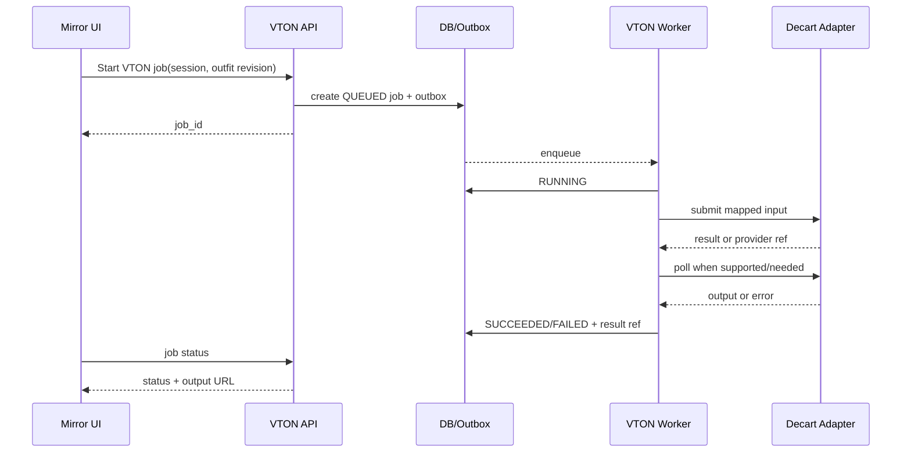

# Smart Wardrobe — Backend LLD v1.1

> 문서 유형: Low-Level Design (Backend)  
> 작성일: 2026-10-08  
> 상위 문서: `03_ARCHITECTURE_HLD_v1.1.md`, `04_FSD.md`  
> 상태: 구현 지향 상세설계 초안. HTTP 필드/DDL은 후속 OpenAPI·SQL 문서에서 확정.  
> 범위: FastAPI, 3개 Agent/서비스, Digital Twin, Decart Adapter, 이벤트, Worker, 트랜잭션, Mock 연동.

## 1. 설계 결정과 불변조건

- **배포 형태:** Python FastAPI 모듈형 모놀리스 + PostgreSQL + Redis(큐/캐시, 선택) + Worker + Object Storage + 별도 카드 렌더러(React/Playwright). MVP는 단일 저장소·docker compose를 기본으로 한다.
- **모듈 책임:** API Router → Application Use Case → Domain Policy → Repository / Provider Adapter. Agent가 ORM 세션이나 외부 HTTP를 직접 제어하지 않는다.
- **권한:** 모든 가구/사용자 범위 데이터에 `household_id`와 요청자 권한을 적용. 클라이언트의 `member_id`는 인증·세션의 scope와 교차 검증.
- **실제 착용:** `OutfitSessionEnded` ≠ `OutfitWearConfirmed`; 미러 종료만으로 `WEAR_EVENT`를 생성하지 않는다.
- **위치 정보:** `GARMENT_OBSERVATION`은 관측 사실, `GARMENT_STATE`는 현재 추정. 신뢰도가 낮거나 오래된 위치는 unknown/uncertain을 허용한다.
- **보관 실행:** 추천/승인/실제 이동 확인을 분리한다. 승인만으로 위치를 변경하지 않는다.
- **외부 연동:** ThinQ CLO는 structured-command Mock, VTON은 Decart Provider Adapter, 센서는 Mock Observation으로 개발 가능. 외부 계약은 검증 전 임의로 단정하지 않는다.
- **안정성:** DB 변경과 Outbox 삽입은 하나의 트랜잭션. 외부 호출/이미지 렌더링은 DB 트랜잭션 밖에서 실행.

## 2. 런타임 컴포넌트 및 의존 방향



**의존성 규칙:** `presentation → application → domain`; infrastructure는 domain의 port를 구현한다. `domain`은 FastAPI, SQLAlchemy, Redis, Decart SDK에 의존하지 않는다. 동일 서비스의 동기 처리에는 직접 use case 호출, 장기 작업에는 job+queue, 다른 도메인의 후속 반응에는 event를 사용한다.

### 2.1 디렉터리 구조

```text
backend/
  app/
    main.py
    core/{config.py,security.py,errors.py,logging.py,clock.py}
    api/v1/{auth,home,garments,context,recommendations,outfits,styles,vton,cards,history,care,storage,settings,jobs}.py
    schemas/                   # 외부 Pydantic DTO; OpenAPI 생성 원본
    application/
      common/{uow.py,authorization.py,idempotency.py}
      garments/  context/  recommendations/  outfits/  styles/
      vton/  cards/  history/  care/  storage/  settings/
    domain/
      garment/  outfit/  recommendation/  storage/  care/
      events.py
    infrastructure/
      db/{models,repositories,migrations}/
      adapters/{decart.py,mock_vton.py,thinq_mock.py,weather.py,calendar.py,sensors.py,object_storage.py,card_renderer.py}
      queue/{producer.py,consumer.py,outbox_dispatcher.py}
    workers/{vton_worker.py,card_worker.py,storage_worker.py,context_worker.py}
  tests/{unit,integration,contract,e2e}/
  alembic/
renderer/                      # React/CSS 카드 템플릿 + Playwright worker
infra/{compose.yaml,env.example}
```

**런타임 권장:** Python 3.12+, FastAPI, Pydantic v2, SQLAlchemy 2.x async, Alembic, PostgreSQL. 큐는 Redis 기반 RQ/Celery 등 **하나만** 선정한다. 구체 버전과 큐 구현은 구현 계획에서 잠근다.

## 3. 도메인별 서비스 및 소유 데이터

| 도메인 | Use Case / 책임 | 소유 데이터(논리) | 주요 FSD |
|---|---|---|---|
| Common | 프로필 세션, 권한, 홈 집계 | HOUSEHOLD, MEMBER, SESSION/NOTIFICATION | COM-001~002 |
| Garment | 등록·목록·상세·인식 상태 융합 | GARMENT, GARMENT_TAG, GARMENT_OBSERVATION, GARMENT_STATE | GAR-001~004 |
| Context | 외부 데이터 수집·정규화·스냅샷 | CONTEXT_SNAPSHOT | REC-001 |
| Recommendation | 후보 생성·필터·점수·설명 | RECOMMENDATION_RUN, 추천 후보 | REC-002 |
| Outfit | 코디·항목·세션·수정 이벤트 | OUTFIT, OUTFIT_ITEM, OUTFIT_SESSION, SESSION_EVENT | OUTFIT-001~002, VTON-001/003/004 |
| Style | 외부 참고 이미지·출처·보관함 | STYLE_REFERENCE | STYLE-001 |
| VTON | 요청 검증·job·결과 매핑 | VTON_JOB, VTON_RESULT | VTON-001~004 |
| Card | 템플릿 데이터·job·저장·공유 | OUTFIT_CARD, CARD_RENDER_JOB | CARD-001~003 |
| History | 착용 확인·기록 조회 | WEAR_EVENT, OUTFIT_FEEDBACK | HIST-001~002 |
| Care | 가이드·일정·수행 | CARE_PROFILE, CARE_SCHEDULE, CARE_EVENT | CARE-001~003 |
| Storage | 위치 조회·보관 최적화·승인·완료 | STORAGE_LOCATION, ENVIRONMENT_READING, STORAGE_ACTION, STORAGE_ACTION_ITEM | STO-001~004 |
| Settings | 사용자 선호·연동 동의 | MEMBER_SETTINGS, INTEGRATION_SETTINGS | SET-001 |
| Platform | outbox, idempotency, audit, job status | DOMAIN_EVENT_OUTBOX, IDEMPOTENCY_KEY, AUDIT_LOG | 공통 |

이 표는 **논리적 소유권**을 뜻한다. 물리 테이블의 확정은 후속 DDL에서 한다. 기존 HLD의 11개 보관 테이블은 보존하되, 서비스에 필요한 확장 테이블을 추가한다.

## 4. Application Use Case 공통 계약

모든 명령은 `ActorContext(household_id, member_id, roles, session_id, correlation_id)`와 요청 DTO를 받는다. 출력은 DTO 또는 `job_id`이며, domain exception을 표준 API 오류로 변환한다.

```python
class UseCase(Protocol[RequestT, ResultT]):
    async def execute(self, actor: ActorContext, request: RequestT) -> ResultT: ...
```

- **조회:** scope 확인 → repository read → 응답 DTO 변환. 다른 가구의 레코드는 존재 여부를 노출하지 않는다.
- **명령:** scope 확인 → idempotency/버전 검사 → 도메인 정책 → UnitOfWork 트랜잭션에서 저장+outbox → commit → 응답.
- **비동기 명령:** job 생성+outbox → commit → dispatcher가 worker 호출 → 결과/오류 저장 → 상태 조회.
- **수정 동시성:** 세션·보관 작업·코디 편집에 `version` 또는 `updated_at` 조건부 업데이트 적용. 충돌은 `CONFLICT`.
- **시간:** UTC timestamp 저장, 사용자 timezone은 별도 저장·표시. Context Snapshot은 당시 값의 불변 사본.

## 5. Agent ① 보관·찾기 — 상세 실행 설계

### 5.1 의류 찾기: 일반 서비스 (STO-001)

`ThinQ CLO Mock / UI → StructuredGarmentQuery(owner_id, category, color, attributes) → Authorization → GarmentLocator → garment + garment_state + storage_location → 위치·confidence·last_seen_at`.

- 자연어 해석/LLM은 범위 밖. Structured Command의 스키마 검증과 허용 필터 화이트리스트만 수행.
- 위치 미확인: `location=null`, `status=UNKNOWN`, `last_seen_at` 및 대체 안내 반환.
- 동명이인 이름을 DB 조건으로 바로 사용하지 않는다. 가구 내 사용자 식별자를 resolve한 후 조회.

### 5.2 보관 최적화: 판단 모듈 (STO-002, STO-003)



**Hard constraints:** 가구 소유권, 사용 가능 공간, 수용량 단위, 소재·케어 금지 조건, 위치 접근성, 상태가 unknown인 의류의 자동 이동 불가. **Soft score 예시:** 최근 착용 빈도, 계절 적합도, 꺼내기 편의, 습도 위험, 이동 비용. 가중치와 임계값은 config 버전으로 관리하며 임의의 정확도 수치를 보장하지 않는다.

**Solver:** 초기에는 deterministic scoring + greedy allocation; 공간 용량/다중 제약이 복잡할 때 OR-Tools CP-SAT adapter 선택. 해결 불가능하면 `NO_FEASIBLE_PLAN`과 제약 위반 이유를 반환. 추천은 사용자 승인 전 자동 실행되지 않는다.

### 5.3 케어: 일반 서비스 (CARE-001~003)

케어라벨/소재에 근거한 `CareRuleEngine`이 가이드를 반환한다. 라벨 미확인 시 일반 권장사항임을 표시한다. `CARE_SCHEDULE`과 `CARE_EVENT`는 계획/수행을 분리하며, 일정 완료가 실제 세탁 사실을 자동 입증하지 않는다.

## 6. Agent ② 사용자 옷 추천 — 상세 실행 설계

### 6.1 Context 수집 (REC-001)

`ContextCollector`는 사용자 일정, 날씨(기온·습도·강수), 시간대·요일·휴일, 사용자 지정 목적을 provider별로 수집한다. 각각 `source`, `observed_at`, `freshness`, `is_mock`, `missing_fields`를 남긴다. 일정의 만남 대상은 사용자가 허용한 범위에서만 사용한다. 외부 실패 시 부분 Context를 저장하고 누락값을 임의 사실로 보충하지 않는다.

### 6.2 추천 실행 (REC-002)



**MVP score (설계 예시, 튜닝 대상):** `score = w1*context_fit + w2*preference_fit + w3*wear_history_fit + w4*coherence - w5*recent_repeat_penalty`. 모든 feature는 정규화하고 hard filter를 통과한 후보에만 적용. Cold start에서는 날씨/목적 기반 규칙을 사용하며 `confidence`를 과장하지 않는다. 사용자가 명시적으로 고른 테마는 과거 패턴보다 우선할 수 있다. LLM은 후보 설명/테마 해석에 선택적으로 쓰고 유효 의류 ID 검증은 deterministic하게 수행.

### 6.3 피드백/학습 경계

추천 후보 노출, 선택, 교체, 세션 종료, 착용 확인을 각각 이벤트로 기록한다. **학습용 positive signal:** 사용자의 명시적 선택·착용 확인. **약한 signal:** VTON 미리보기·카드 저장. 부정 signal은 명시적 거절과 수정 내역을 구분. 추천 시점에 사용 가능한 과거 이력만 사용해 미래 정보 누출을 막는다. MVP는 주기적 feature 집계/가중치 업데이트이며 온라인 ML 학습은 필수 아님.

## 7. Agent ③ 코디카드 — 상세 실행 설계

`CardComposer`가 `outfit_id + context_snapshot_id + template_id`를 검증하고, 의류 이미지 asset 참조와 메타데이터를 `CardRenderPayload`로 구성한다. 템플릿은 버전 고정된 React/CSS로 구현한다. 생성은 worker에서 수행하며 Playwright screenshot은 **1080×1350 PNG** 기본, WebP 선택. 결과 이미지는 Object Storage에 업로드하고 카드 레코드에 URL/asset key를 저장한다.



**실패:** 이미지 누락은 명시된 placeholder 정책 또는 실패 처리; Playwright timeout은 제한된 횟수 재시도; 동일 `job_id`의 재실행은 중복 카드/이미지 생성을 방지. 공유 링크는 별도 공개 범위/만료 정책을 따른다. 코디카드 저장은 착용 확인이 아니다.

## 8. 공통 VTON 및 Decart Adapter

### 8.1 Port / Provider-neutral DTO

```python
class VtonProvider(Protocol):
    async def submit(self, request: VtonProviderRequest) -> ProviderSubmission: ...
    async def get_status(self, provider_job_id: str) -> ProviderStatus: ...
    async def cancel(self, provider_job_id: str) -> bool: ...  # 지원 시에만
```

`VtonProviderRequest`: 사용자 이미지 asset, garment image asset 목록 또는 provider가 지원하는 의류 표현, fit/config, correlation ID. `ProviderSubmission`: provider job reference 또는 즉시 결과. `ProviderStatus`: `PENDING|RUNNING|SUCCEEDED|FAILED`, output asset, failure category. **실제 Decart API가 해당 비동기/다중 의류 인터페이스를 지원한다는 뜻은 아니다.** Adapter가 확인된 Decart 규격으로 변환하고 미지원 기능은 capability error 또는 명시적 mock으로 처리한다.

### 8.2 호출 흐름



- 이미지 데이터는 사용자 동의, 최소 보존 기간, 서명 URL/서버측 fetch, MIME/크기 제한을 적용한다. API key는 서버에만 저장.
- provider 요청에는 timeout, rate limit, concurrency limit, bounded retry/backoff를 적용. 비재시도성 4xx/정책 오류는 즉시 실패.
- `provider_job_id`가 없는 동기 API라면 worker 내부 단일 호출로 수렴시킨다.
- 의류 교체 시 `outfit_revision`을 증가시키고 새 job을 만든다. **이전 job이 늦게 완료되어도 최신 결과를 덮어쓰지 못하게** revision을 비교한다.
- Mock/Live는 응답의 `provider_mode`로 명확히 구분. Mock 이미지를 실제 VTON 결과로 표시하지 않는다.

## 9. 주요 상태 머신

### 9.1 Outfit / VTON 세션

```text
OUTFIT_SESSION: CREATED → ACTIVE → ENDED | CANCELLED | EXPIRED
OUTFIT: DRAFT → SAVED → ARCHIVED (선택적)
VTON_JOB: QUEUED → RUNNING → SUCCEEDED | FAILED | TIMED_OUT | CANCELLED
CARD_JOB: QUEUED → RUNNING → READY | FAILED | CANCELLED
```

- `ACTIVE`에서 코디 수정 가능; 수정마다 revision 증가 및 `OutfitModified` 기록.
- `ENDED` 시 최종 코디 스냅샷 저장. 재수정은 새 세션 또는 명시적 재개 규칙이 필요하다.
- `OutfitWearConfirmed`는 사용자 확인/검증된 외부 신호에서만 발생하며 세션 종료와 독립적이다.

### 9.2 Storage Action

```text
PROPOSED → APPROVED → IN_PROGRESS → AWAITING_CONFIRMATION → COMPLETED
         ↘ REJECTED         ↘ FAILED
PROPOSED → EXPIRED
APPROVED → CANCELLED (실행 전)
```

허용되지 않는 상태 전이는 `INVALID_STATE_TRANSITION`. 실제 이동 관측이 충돌하거나 confidence가 낮으면 `AWAITING_CONFIRMATION` 유지. 다중 의류 작업은 item별 상태를 갖고 헤더 상태를 집계한다. 부분 완료 허용 여부는 작업 단위로 명시한다.

## 10. 이벤트 계약과 전달 보장

### 10.1 Event Envelope

```json
{
  "event_id": "uuid",
  "event_type": "OutfitSessionEnded",
  "aggregate_type": "outfit_session",
  "aggregate_id": "uuid",
  "aggregate_version": 4,
  "household_id": "uuid",
  "occurred_at": "2026-10-08T03:00:00Z",
  "schema_version": 1,
  "correlation_id": "uuid",
  "payload": {"outfit_id": "uuid", "revision": 4}
}
```

### 10.2 Producer / Consumer

| 이벤트 | Producer | Consumer | 멱등 처리 |
|---|---|---|---|
| GarmentObserved | Recognition | Garment state projector | observation/event ID unique |
| GarmentStateChanged | Garment | Recommendation cache, home | version compare |
| OutfitRecommended | Recommendation | Outfit history/analytics | recommendation run ID |
| OutfitModified | Outfit | session event log | session + revision unique |
| OutfitSessionEnded | Outfit | history, home | session ID unique |
| OutfitWearConfirmed | History | wear aggregate, storage analytics | confirmation ID unique |
| CardGenerationRequested | Card | card worker | card job ID unique |
| CardReady | Card worker | home/outfit notification | card ID + version |
| StorageActionApproved | Storage | storage workflow | action ID + version |
| StorageActionCompleted | Storage | garment state/analytics | action item ID unique |
| CareCompleted | Care | care history/home | care event ID unique |

**전달 의미:** Outbox dispatcher는 at-least-once 전송을 전제한다. Consumer는 `processed_event` 또는 고유 제약으로 중복 실행을 막는다. outbox는 `PENDING → PUBLISHED`(또는 재시도/DEAD)이며 worker 성공과 이벤트 게시 성공을 혼동하지 않는다.

### 10.3 n8n 경계

n8n은 날씨/캘린더 동기화, 정기 분석 트리거, 알림·외부 webhook 연동에 한정. 직접 DB 변경 금지; 인증된 내부 API 호출 또는 정해진 event consumer만 사용. n8n 장애가 의류 CRUD/코디 저장 트랜잭션을 중단시키지 않는다.

## 11. Worker, 재시도, 장애 복구

| 작업 | 실행 방식 | 재시도 | 최종 실패 처리 |
|---|---|---|---|
| VTON | queue worker + provider adapter | 네트워크/5xx/429에 bounded backoff | FAILED/TIMED_OUT + 오류 범주 |
| Card render | queue worker + Playwright | 일시적 렌더러 장애 재시도 | FAILED + 사용자 재시도 |
| Context refresh | scheduled worker / n8n trigger | 소스별 독립 재시도 | partial snapshot, stale 표시 |
| Storage optimization | scheduled/on-demand worker | 제한된 재시도 | 실행 불가 사유 저장 |
| Outbox dispatch | polling worker | at-least-once + backoff | dead-letter / 운영 경고 |
| Observation processing | queue or synchronous small batch | event ID 멱등 | 관측 보존, 상태 불확실 |

공통 job 필드: `id, type, status, progress?, attempt_count, max_attempts, created_at, started_at, finished_at, error_code, error_message_safe, correlation_id, result_ref`. Worker lease/heartbeat와 stuck-job recovery를 제공. 프론트는 `job_id`로 polling하며 추후 SSE 확장 가능.

## 12. 트랜잭션 경계 / 동시성

| 명령 | 원자적으로 커밋할 항목 | 트랜잭션 밖 |
|---|---|---|
| 의류 등록 | garment + initial state + asset reference + outbox | 업로드/이미지 분석; 실패 asset 정리 |
| 센서 관측 반영 | observation + conditional garment state + outbox | 센서 입력 수신 |
| 추천 실행 저장 | recommendation run + candidate refs + outbox | weather/calendar fetch, candidate scoring |
| 코디 수정 | outfit revision + session event + outbox | VTON 호출 |
| 세션 종료 | session final snapshot + ended event | VTON/card 작업 완료 대기 불필요 |
| 착용 확인 | confirmation + wear event(s) + outbox | 추천 feature 비동기 집계 |
| 카드 요청 | card job + outbox | Playwright, object storage upload |
| 카드 완료 | card result ref + job status + outbox | 이미지 생성·업로드 |
| 보관 승인 | action state/version + approver + outbox | 실제 물리 이동 |
| 보관 완료 | action items + garment state conditional update + outbox | 외부 센서 확인 |
| 케어 완료 | care event + schedule state + outbox | 외부 알림 |

**충돌 제어:** row version optimistic locking; `expected_version` 미일치 시 409. 착용 확인은 `confirmation_id`로 멱등. 위치 갱신은 관측 시각/신뢰도/상태 버전을 함께 검사하여 늦게 도착한 관측이 최신 상태를 덮어쓰지 못하도록 한다. 카드·VTON object upload 성공 후 DB commit 실패 시 orphan asset cleanup 작업으로 보상한다.

## 13. IA 화면별 Backend 데이터 공급

| IA 화면 | Backend composition | 관련 기능 |
|---|---|---|
| 잠금/홈 | session + today context + recommendation + care alerts | COM-001/002, REC-001/002 |
| 옷장 > 내 옷 보기 | garment list/filter + state summary | GAR-001 |
| 옷장 > 옷 상세 | garment detail + care + location | GAR-002, CARE-001 |
| 옷장 > 옷 등록 | upload/registration + recognition status | GAR-003/004 |
| 코디 > 내 코디 | saved outfits + cards | OUTFIT-001, CARD-003 |
| 코디 > 스타일 보관함 | style references by source | STYLE-001 |
| 코디 > 코디 만들기 | outfit editor + recommendation | OUTFIT-002, REC-002 |
| 캘린더 | wear events + care events | HIST-001/002, CARE-003 |
| 케어 > 일정/가이드 | care schedule + care rules | CARE-001/002/003 |
| 마이 | settings/consents/integration modes | SET-001 |
| 공통 입어보기 | VTON session + job status + final selection | VTON-001~004 |
| 코디카드 | card preview/render job + save/share | CARD-001~003 |
| ThinQ CLO Mock | structured search / storage action | STO-001~004 |

API 명세는 이 데이터 공급표를 기준으로 **화면 친화적인 조회 DTO**를 제공하되, 도메인 명령의 경계는 유지한다.

## 14. 공통 오류·보안·관측성

**오류 분류:** `UNAUTHENTICATED`, `FORBIDDEN`, `NOT_FOUND`, `VALIDATION_ERROR`, `CONFLICT`, `INVALID_STATE_TRANSITION`, `NO_ELIGIBLE_GARMENTS`, `LOCATION_UNCERTAIN`, `NO_FEASIBLE_PLAN`, `PROVIDER_UNAVAILABLE`, `PROVIDER_UNSUPPORTED`, `RATE_LIMITED`, `JOB_TIMEOUT`, `RENDER_FAILED`. 모든 오류는 안정적인 machine code와 사용자 표시 가능한 safe message를 갖는다. Provider 원문 오류/키/개인 이미지는 로그에 출력하지 않는다.

**보안:** 사용자·가구별 RBAC/ownership 검사, 이미지 업로드 파일 검증, signed URL, server-side API keys, 외부 연동 동의, 사용자 이미지 보존·삭제 정책, 데이터 최소 수집, CORS allowlist, rate limiting, audit trail. Mock 모드는 운영 환경에서 기본 비활성화.

**관측성:** `request_id`, `correlation_id`, `job_id`, `provider_mode`, duration, retries, outcome을 구조화 로그/메트릭에 남긴다. VTON latency, card render latency, job failure, stale garment state, 추천 후보 없음, outbox backlog를 측정한다. 정확도나 KPI 목표 수치는 실측 전 확정하지 않는다.

## 15. 테스트 경계 및 완료 조건

- **Unit:** scoring, filtering, storage constraints, state transition, care rules, revision conflict, event envelope.
- **Integration:** SQLAlchemy repository + PostgreSQL transaction rollback, outbox atomicity, household isolation, job lifecycle.
- **Contract:** Decart adapter mock contract, card renderer payload, structured ThinQ mock command, OpenAPI DTO.
- **E2E:** FSD 9개 수용 시나리오를 기준으로 seed data에서 홈 → 추천 → VTON mock/live → 수정 → 카드 → 착용 확인, 검색 → 보관 제안 → 이동 확인, 케어 완료 흐름을 재현.
- **Failure:** Decart 429/timeout, 이미지 누락, 중복 이벤트, 늦게 완료된 VTON job, 잘못된 household, stale observation, concurrent approval, renderer crash.

완료 조건: 28개 FSD 기능이 담당 use case에 추적 가능하고, 비동기 job의 상태 조회·실패 복구·멱등 처리, DB/outbox 원자성, Mock 모드 E2E가 구현 가능하도록 설계되어 있을 것.

## 16. 후속 문서 인계

### 16.1 OpenAPI 3.1에서 확정할 것

- `/api/v1` 경로, DTO 필드·nullable·enum, 인증 방식, 페이지네이션, idempotency key, optimistic version, 비동기 job polling, signed asset URL, 오류 형식.
- 추천·VTON·카드·보관 승인 API는 각각 독립적인 명령 계약으로 설계.
- 외부 Decart의 실제 endpoint/payload/capability는 공식 규격 확인 후 adapter 내부에만 반영.

### 16.2 PostgreSQL DDL에서 확정할 것

- 기존 보관 11개 테이블과 outfit/session/context/card/job/care/style/outbox 확장 테이블의 PK/FK/unique/index.
- `OUTFIT_ITEM` 다대다, `WEAR_EVENT`와 확인 근거, session revision, action item 상태, observation 시계열 인덱스, household scope.
- 외부 이미지 원본은 Object Storage에 보관하고 DB에는 asset key/metadata만 저장.

### 16.3 아직 미확정인 의사결정

1. Decart의 실제 지원 API(이미지/영상, 동기/비동기, 복수 의류, 입력 제약, 비용) 및 법적/보안 조건.
2. 사용자 실제 착용 확인의 제품 UX/센서 방식. 프로토타입은 명시적 사용자 확인을 기본값으로 사용.
3. 물리 센서/RFID 인식 융합 임계값과 보관 공간 용량 단위.
4. 작업 큐·Object Storage의 구체 제품과 배포 환경.
5. 공개 코디카드 공유 URL의 권한·만료·삭제 정책.

이 항목들은 미검증 사실을 가정하지 않고 adapter/config로 격리한다. API·DB 명세 작성은 이를 막지 않는다.

---

**Traceability:** `COM-001~002`, `GAR-001~004`, `REC-001~002`, `OUTFIT-001~002`, `STYLE-001`, `VTON-001~004`, `CARD-001~003`, `HIST-001~002`, `CARE-001~003`, `STO-001~004`, `SET-001` = FSD 28개 기능 전체.

## Sprint 1 계약 개정 (2026-10-08)

사용자 승인에 따라 네 충돌의 정책을 확정했다. [결정 계약](SPRINT_1_CONTRACT_DECISIONS.md)이 Sprint 1의 역할·상태·공유·동의·보관·관측·삭제 정책의 기준이며, 개정 OpenAPI 1.1.0 및 DDL과 함께 적용한다. DEMO는 역할이 아닌 인증 모드다. 0001 SQL은 동결하고 0002 전진 migration으로 현재 32개 테이블을 구성한다. 케어 가이드 본문과 실제 센서 ingress는 기존 후속 Sprint/Mock 경계를 유지한다. 의류 이미지만 30일 보관하고 PERSON/VTON 자산 정책은 해당 Sprint에서 별도 확정한다.
